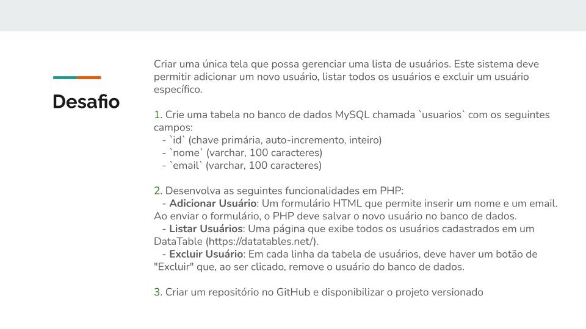

# Desafio - onetouchhealth



--
## CRUD de Usuários (Adicionar e Excluir)

Este projeto é um sistema simples de gerenciamento de usuários, permitindo adicionar e excluir usuários. O sistema foi desenvolvido em PHP puro, e exibe os dados em uma tabela interativa usando o **DataTables**. O projeto contém três campos básicos: `id`, `nome` e `email`.

### Funcionalidades

- Adicionar novos usuários (com nome e e-mail).
- Excluir usuários existentes.
- Listar usuários em uma tabela interativa com busca e paginação.

### Pré-requisitos

- PHP 8.x ou superior
- Servidor Web (Apache ou Nginx)
- MySQL

### Configuração

#### 1. Clone o repositório

```bash
git clone https://github.com/robsonamendonca/onetouchhealth.git
```

#### 2. Configuração do Banco de Dados

1. Crie um banco de dados MySQL.
2. Importe o arquivo `DumpBanco.sql` que contém a estrutura necessária para a tabela `usuarios`.

```bash
mysql -u root -p nome_do_banco < DumpBanco.sql
```

#### 3. Configuração do Projeto

1. Navegue até a pasta `config` e edite o arquivo `conexao.php` para configurar a conexão com seu banco de dados:

#### 4. Executar o Projeto

1. Coloque o projeto no diretório do seu servidor local (por exemplo, `htdocs` no XAMPP ou `www` no WAMP).
2. Acesse o projeto no navegador:
```
http://localhost/onetouchhealth/index.php
```

### Estrutura do Projeto

- `config/` – Arquivos de configuração (conexão com o banco de dados).
- `assets/` – Arquivos diversos (imagem, json, js).
-
### Tabela `usuarios`

A tabela `usuarios` possui os seguintes campos:

- `id` (INT, AUTO_INCREMENT) – Identificador único do usuário.
- `nome` (VARCHAR) – Nome do usuário.
- `email` (VARCHAR) – E-mail do usuário.

### Dump SQL

O arquivo `DumpBanco.sql` contém a estrutura do banco de dados. Certifique-se de importar este arquivo para criar a tabela de usuários.

### Como Usar

1. **Adicionar Usuário**: Clique no link "Adicionar Usuário" e preencha o formulário com o nome e e-mail.
2. **Excluir Usuário**: Na listagem de usuários, clique na imagem de um "X" para confirmar a remoção do usuário.

---

**Autor:** Robson Mendonça
**Licença:** MIT